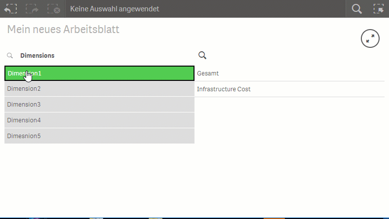

# Selector Extension

This extensions developed for blind users to make selections with full
keyboard control and full [JAWS](http://www.freedomscientific.com/Products/Blindness/JAWS) support.

## Intro

## Settings

### Dimensions

In the dimension section you can choose the fields and dimension you want to display in the extensin.

### Options

In the accessibillity options you can switch the use of shortcuts from the default values to customise shortcuts. The recommendation ist to use the combination of "strg + alt + {any keycode}", so that you do not get in truble with screenreaders shortcuts. Second you can switch the accessibillity option on, so that the screenreader gets triggered with any action made in this extension.

## Install

### binary

1. [Download the ZIP](https://m.sense2go.net/extension-package) and unzip
2. Qlik Sense Desktop
   Copy it to: %homeptah%\Documents\Qlik\Sense\Extensions and unzip
3. Qlik Sense Entripse
   Import in the QMC

### source

1. Clone the Github Repo into extension directory
2. Install [nodejs](https://nodejs.org/)
3. Open Node.js command prompt
4. npm install
5. npm run build
